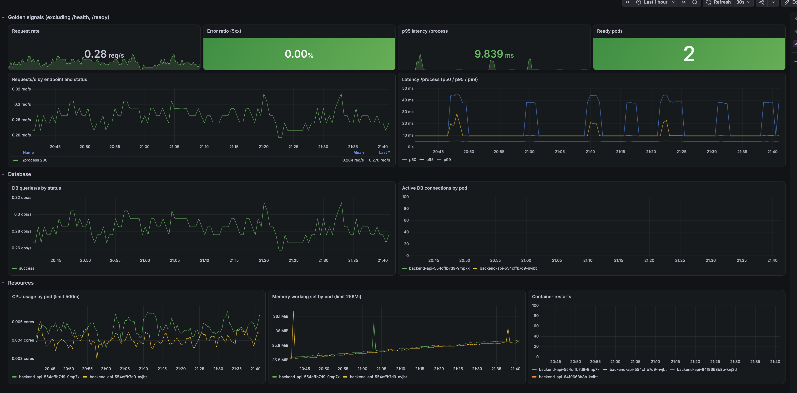
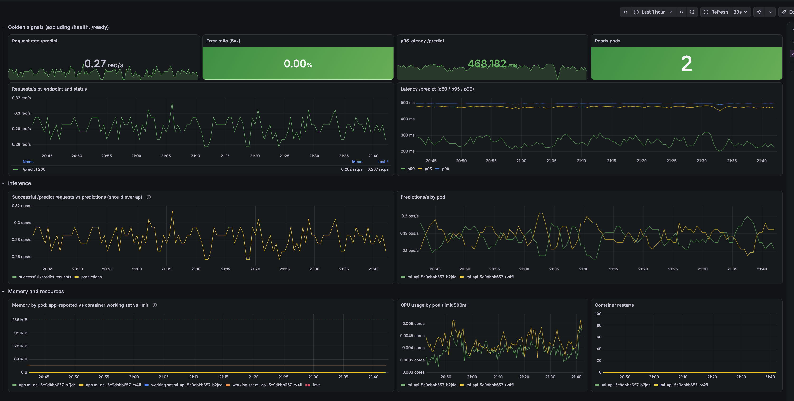
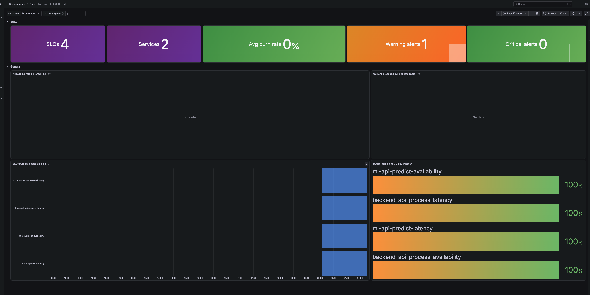

# DevOps Case Study

## Overview

A local k3d cluster managed with GitOps (Flux CD). Flux deploys two Python APIs (`backend-api`,
`ml-api`) with PostgreSQL and a load generator, plus a monitoring stack for metrics, logs,
dashboards, SLOs and alerts. Every change is made in Git; Flux applies it to the cluster.

```bash
export GITHUB_TOKEN=<token>
./bootstrap/bootstrap.sh https://github.com/<user>/devops-case-study main
```

| Path | Contents |
| --- | --- |
| `apps/` | The workloads, plus a ServiceMonitor per API |
| `infrastructure/controllers/monitoring/` | kube-prometheus-stack, Loki, Alloy (HelmRelease + `values.yaml` each) |
| `infrastructure/configs/` | Dashboards, SLO rules, alerts, Flux PodMonitor |
| `slos/` | SLO definitions (Sloth), see [slos/README.md](slos/README.md) |

Access (Grafana user `admin`, password generated into a Secret):

```bash
kubectl get secret -n monitoring kube-prometheus-stack-grafana -o jsonpath='{.data.admin-password}' | base64 -d
kubectl port-forward -n monitoring svc/kube-prometheus-stack-grafana 3000:80
```

## Found issues

1. **Bootstrap fails with `namespaces "postgres" not found`.** `flux bootstrap` returns before
   Flux has created the app namespaces, and `kubectl wait` fails at once on missing resources.

   **Fix:** the script first waits for the Flux `apps` Kustomization to be Ready.

2. **App `endpoint` label overwritten when scraping.** The Prometheus Operator sets its own
   `endpoint` label (the port name) and renames the app's label to `exported_endpoint`, so
   per-endpoint queries silently return wrong results.

   **Fix:** `honorLabels: true` in the ServiceMonitors.

3. **Every `/process` request returned 500 (`relation "documents" does not exist`).**
   backend-api creates its table at startup, but on a fresh cluster it starts before postgres
   is ready, and it does not retry. Found via the 5xx ratio, `backend_api_db_queries_total{status="error"}`
   and the postgres logs in Loki; the SLO burn-rate alert fired for it.

   **Workaround:** once postgres is up, restart backend-api so it creates the table on startup:

   ```bash
   kubectl rollout restart deployment/backend-api -n backend-api
   ```

   A permanent fix (postgres init script + PVC) is in the ToDo list.

4. **`NodeClockNotSynchronising` always firing.** False positive on k3d / Docker Desktop (the
   clock is synced by the host VM, not by NTP inside the node).

   **Fix:** disabled in `values.yaml`.

## Monitoring stack

| Part | How |
| --- | --- |
| Metrics | kube-prometheus-stack (chart 92.1.0): Prometheus on a 10Gi PVC (7d / 8GB retention), Alertmanager, Grafana, node-exporter, kube-state-metrics |
| App scraping | ServiceMonitors for backend-api and ml-api (`/metrics`, 15s); Flux controllers via a PodMonitor |
| Logs | Loki (single binary, 5Gi, 7d retention) + Alloy shipping all pod logs |
| Dashboards | Backend API, ML API (golden signals, database / inference, resources), SLO overview and detail, each in its own Grafana folder |
| SLOs | Availability 99.5% non-5xx; latency 99% under 250ms (backend-api) / 1s (ml-api); rolling 28 days. Defined in Sloth, which generates the rules |
| Alerts | SLO burn-rate alerts for symptoms (page on fast burn, ticket on slow burn); `BackendApiDown`, `MlApiDown`, `BackendApiDbQueryErrors`, `MlApiNoPredictions` for causes and blind spots; kube-prometheus-stack defaults for the platform |
| Resources | CPU/memory requests and memory limits for every monitoring component, sized from observed peak usage: Prometheus 512Mi / 2Gi, Loki 256Mi / 1Gi, Grafana 512Mi / 1Gi (it runs at ~600Mi), the smaller components 16–128Mi. No CPU limits, to avoid throttling |

### Dashboards

**Backend API**: golden signals at the top (request rate, 5xx ratio, p95 latency, ready pods),
then database and resources, read top to bottom from symptom to cause.



**ML API**: the same golden signals, then inference (successful `/predict` requests vs
predictions; the two lines should overlap, a gap means a silent failure) and memory: what the app
reports (`ml_api_memory_bytes`, currently always 0) against the container's real usage and limit.



**SLOs** (official Sloth dashboard): all 4 SLOs with their burn rate and remaining error budget,
plus how many SLO alerts are firing. The warning alert is `BackendApiAvailabilityBudgetBurn`
(ticket) for the missing-table outage (issue 3).



## What we monitor and alert on

**Approach:** start from what users experience (errors, latency), then go down to the causes
(database, predictions, pods). Health-check endpoints (`/health`, `/ready`) are excluded
everywhere: they are most of the traffic and would hide real errors.

### What we monitor

`*` stands for `backend_api` / `ml_api`; both APIs are monitored the same way.

| Signal | What we look at | Why |
| --- | --- | --- |
| Traffic | `*_requests_total`, by endpoint and status | Baseline load; a drop to zero is an outage too |
| Errors | 5xx ratio on `/process` and `/predict` | The most direct sign of user impact |
| Latency | p50 / p95 / p99 of `*_request_duration_seconds` | Slow is as bad as down |
| Database (backend-api) | `backend_api_db_queries_total{status}`, `backend_api_db_connections_active` | DB errors explain backend 5xx |
| Predictions (ml-api) | `ml_api_predictions_total` vs successful `/predict` requests | Requests without a prediction are a silent failure |
| Saturation | CPU, memory vs limit, restarts (and `ml_api_memory_bytes`) | Catch resource pressure before an OOMKill |
| Availability | Ready pods, scrape target `up` | Is the service running at all |

### What we alert on

| Alert | Fires when | Severity | Why |
| --- | --- | --- | --- |
| `BackendApiAvailabilityBudgetBurn`, `MlApiAvailabilityBudgetBurn` | the 99.5% availability error budget burns too fast | page (fast burn) / ticket (slow burn) | Users are getting errors |
| `BackendApiLatencyBudgetBurn`, `MlApiLatencyBudgetBurn` | too many requests are slower than 250ms / 1s | ticket | Users are getting slow responses |
| `BackendApiDown`, `MlApiDown` | no healthy target for the API for 2m | critical | With no pods there are no metrics, so the SLO alerts would stay silent |
| `BackendApiDbQueryErrors` | > 5% of DB queries fail for 5m | warning | Points to the cause (the database) behind 5xx |
| `MlApiNoPredictions` | `/predict` succeeds but no predictions are made for 10m | warning | Silent failure the error-rate SLO cannot see |
| kube-prometheus-stack defaults | crash loops, failed deployments, node and Prometheus health, ... | various | Platform issues, not duplicated here |

**Principles:** page only on user impact (SLO burn rate, not static thresholds); cause alerts
are warnings, so one incident does not page twice; don't duplicate the default platform rules.

## ToDo later

- **Postgres schema and storage:** create the `documents` table with an init script and use a PVC
  instead of `emptyDir`, so a postgres restart does not wipe the database (issue 3)
- **postgres-exporter:** postgres itself is not monitored yet; today we only see it through
  backend-api's metrics. postgres-exporter would add open connections (`pg_stat_activity`:
  `backend_api_db_connections_active` only counts connections *in use*, so it shows 0 at this
  traffic level), database size, locks and `pg_up`, plus alerts for postgres down or too many
  connections
- **NetworkPolicies:** all pod-to-pod traffic is allowed by default. Restrict postgres to
  backend-api, and the APIs to load-generator and Prometheus
- **ResourceQuota for the `monitoring` namespace** to cap its total CPU/memory. Needs a
  `LimitRange` (or explicit resources on the chart sidecars) first: with a memory quota, every
  container must declare memory, and sidecars like the config reloaders currently don't
- **Flux drift detection** for HelmReleases (`driftDetection.mode`), starting with `warn`
- **Flux object readiness:** kube-state-metrics custom resource state (`gotk_resource_info`)
  plus alerts for Kustomizations / HelmReleases that are not Ready
- **Alert routing:** Alertmanager has no receiver yet; route alerts to Slack / PagerDuty
- **Monitoring the monitoring with `Watchdog`:** Prometheus, Alertmanager and the Operator
  already watch each other (`PrometheusRuleFailures`, `AlertmanagerFailedToSendAlerts`,
  `TargetDown`), and Flux is scraped via a PodMonitor. But if Prometheus or Alertmanager itself
  is down, nothing can alert. `Watchdog` is an alert that *always* fires; routed to an external
  heartbeat service (e.g. Healthchecks.io, Dead Man's Snitch, PagerDuty heartbeat), it becomes
  a dead man's switch: when the heartbeat stops, the external service pages us. Today it fires
  but goes to a `null` receiver.

  ```
  Prometheus ──Watchdog (always firing)──► Alertmanager ──► external heartbeat service
                      heartbeat stops (Prometheus, Alertmanager or the cluster down) ──► page
  ```
- **AI-assisted triage when paging:** an Alertmanager webhook triggers an AI agent that gathers
  context for the firing alert (related metrics, recent Loki logs, Kubernetes events, recent
  Flux / Git changes) and posts a short status with the page: impact, likely cause, suggested
  next steps. The on-call engineer starts with a summary instead of a blank dashboard. The agent
  gets read-only access; the fix stays a human decision
- **Security best practices:** scan regularly and fix the findings, e.g. in CI:
  - `trivy fs .` for manifest misconfigurations and secrets in the repo
  - `trivy k8s` for the running cluster (workloads, image CVEs, RBAC)
  - `kube-bench` for the CIS Kubernetes Benchmark on the nodes / control plane

  Known items: add a hardened `securityContext` (non-root, read-only root filesystem, drop all
  capabilities), patch image CVEs, and move plain-text passwords to encrypted Secrets (SOPS)
